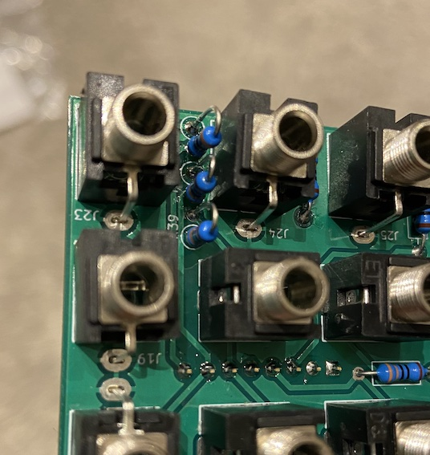
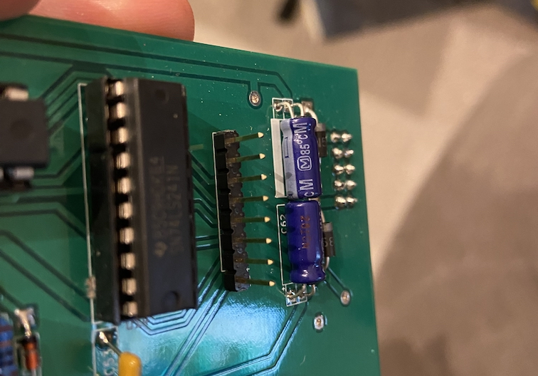
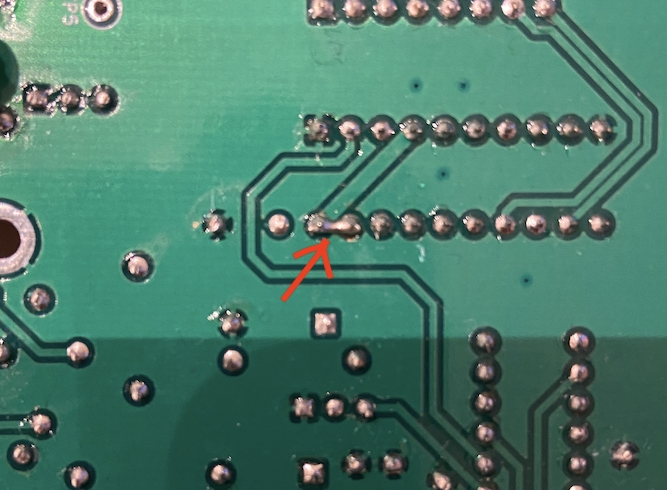
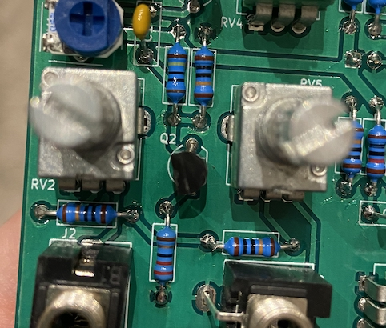
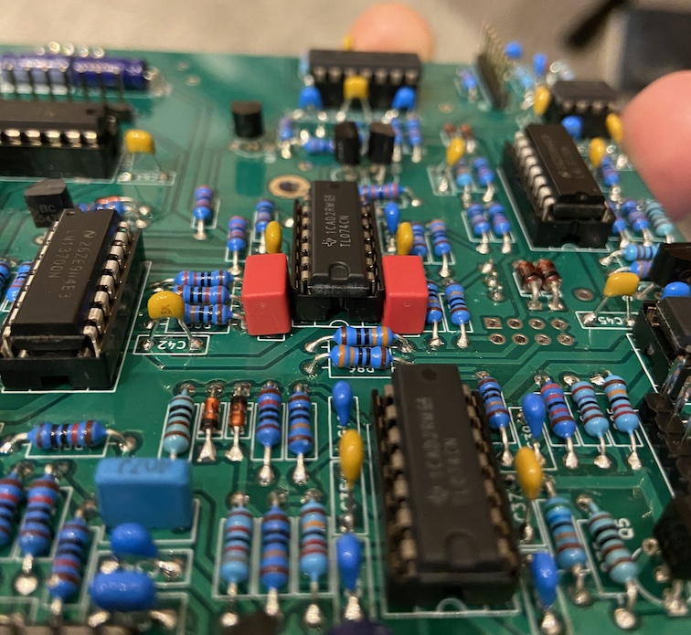

# Ouroboros Build Docs - Revision 2

The Ouroboros is a fairly big build, with a lot of parts, but it shouldn't be an especially difficult one as long as you don't try to rush things.
Mostly it's just a case of putting the parts in the right places and soldering them in, but because this is an early-ish prototype there's a couple of minor issues that need to be fixed. This guide will cover them, with pictures, and try to be as clear as possible with how to go about putting the module together to make sure it all works out fine.

## Building

When building any electronics, it's important to remember that the neater and more methodical you are with placing and soldering the parts, the more likely you are to have a working circuit without a bunch of debugging. There are a few parts placements in the ouroboros that are a little non-standard but for the most part everything should be as expected.

The best way to make sure things go well is to use the interactive bom webpage that's available as part of this project. You can use it to highlight where specific parts go and tick them off once they're placed. It makes life much easier and much less error prone.

### Basics

If you've built some modules before then most of what's here should be obvious, but if not then hopefully you'll find some of the information here useful. It's worth reading it all as this covers instructions for some specific parts.

* Make sure the parts that are meant to lie flat against the board are well set and pressed snugly against the PCB.
* Double check your solder joints. If you're not sure what a good or bad joint looks like then [this guide from adafruit](https://learn.adafruit.com/adafruit-guide-excellent-soldering/common-problems) has some really useful images.
* Trim the legs of soldered devices neatly.
* Certain parts are polarized and have a specific way they should be soldered into the circuit. This should be shown by the footprint on the PCB.
* With parts that need to have their legs bent to be placed in the board, it's easiest to do this before placing them in the PCB.

### Different Parts

##### Resistors

Resistors don't have a direction they need to be solder in, but they should be seated and aligned well. There are a few resistors in the ouroboros that need to go in vertically, and for these just carefully bend one of the legs through 180 degrees and then place them.

##### Diodes

Diodes have to go in with a specific orientation and the circuits won't work properly if they're wrong. There should be a line at one end of the part itself, and a line in the rectangle of the footprint symbol. Make sure these are both at the same end once the part is placed.

##### Capacitors

There are quite a few different types of capacitors used in the circuit, and even though some of them have the same values, they need to go in the correct places. The long, cylindrical capacitors are electrolytic and need to go in the correct orientation. Usually they would also be upright, but in this build they need to have their legs bent at a 90 degree angle and be placed lying down.

There are two other places that confusion with the capacitor values may happen. One is with the 100nF capacitors, where there are both X7R and C0G capacitors. The second is with the 220pF capacitors where there are C0G and film types. The interactive bom webpage does specify the type of caps that need to go in each place, but it's really worth double checking what should be placed.

The X7R and C0G caps should all have the type written on their labels. The film caps don't have labels, but they're bright red and quite chunky so shouldn't be hard to miss. They may also be a little bit awkward to place because I didn't give them quite enough space on the board. Check the fixes for more information.

##### Transistors

The transistors in the circuit should be placed so their flat and curved sides match the footprint on the PCB. Q2 is an exception to this, see the fixes for more information. There are multiple different types of transistor, all of which need to go in the correct places. The bom webpage should show them. There's also the L78L05 voltage regulator, that looks like a transistor but isn't. Don't get it confused with them.

##### IC Sockets

All the ICs in the circuit should use sockets as this makes debugging and error finding much easier. The sockets themselves will work in either orientation, but it's generally a good idea to make sure the notched end of the socket matches the PCB footprint so it's easier to make sure you put the chips in the correct way round.

### Build Order

Different people likely have their preferred ways to build things, and if you're used to something different then feel free to disregard this. Generally the easiest way to go about building is to start with the lowest height components first and work up. My preferred ordering would be

* diodes
* resistors
* IC sockets
* capacitors
* transistors
* trimmers
* pin headers and sockets
* jacks and potentiometers

Some people find it easier to place the capacitors before IC sockets, but my experience is that the caps are taller and it's more faff. Also with this revision there's an issue with spacing for two of the caps, so the socket for U10 really needs to be placed first.

### Pin Headers and Sockets

TODO this section needs to be written, but basically it's just a bit awkward unfortunately.

### Faceplate, Jacks and Potentiometers

Getting the jacks and potentiometers correctly aligned with the faceplate is important to do correctly. The main thing is to have the front panel on and holding them in place before then soldering them. Ideally the process would be

* Place some or all of the jacks and pots in the PCB but don't solder them in
* Make sure there's enough of them in place that the front panel will be properly supported
* Put the front panel on and screw it on with a few of the nuts
* These only need to be hand tightened as it's just to hold the panel in place
* Carefully flip the pcb and panel together and solder the pots and jacks in
* If you only did some of them then remove the front panel, place the rest, put the front panel back on and solder everything in

This should mean that everything is held in place and correctly aligned.

## Fixes and bugs

There are two fixes required for the rev2 PCBs. One that requires cutting a trace then bridging two pins with solder, and the second that's just a transistor that needs to be placed with a different orientation from the PCB footprint.

There's also a couple of bugs with this version as well. None of these problems are major but they're worth calling out to prevent confusion. There's one place where the sizing of the parts is a little off, so you need to make sure you place them in a certain order otherwise things may be awkward. There's also a couple of the headers on the back that aren't used because they're unnecessary or wrong.

#### U14

On IC U14, pin 19 needs to have the connections between it and the ground plane cut carefully and then a connection made between it and pin 20. If you got the boards from me then the cutting should already have been done. The bridging can be done after the IC socket has been soldered in and can simply be blobbed solder between the pins.

#### Q2

Q2 is on the front panel board that holds all the jacks and controls. Assuming that you have the BC547C transistor from the kit, you'll need to place this in the reverse orientation from the footprint on the PCB.

#### C48 and C49

There hasn't quite been enough space given for these capacitors to fit next to the IC socket, and whilst they can still be placed, they may not sit quite properly. This won't affect the way they work at all. The important thing is to make sure you place the IC socket before placing the caps. Otherwise you may have to carefully desolder them to get the socket in.

#### J39

This is meant to be the header to use for programming the ATTiny, but unfortunately the pin connections to the chip are wrong. This won't affect the circuit, and you should have been given a pre-programmed chip as part of the kit, but it means if you want to reprogram it at some point in the future you'll need to remove it from the circuit.

#### JP1

This part is redundant and so you shouldn't place anything here.

#### J38

This header is for more outputs from the filter. I've not yet built anything to use these so you don't need to place any header here.
